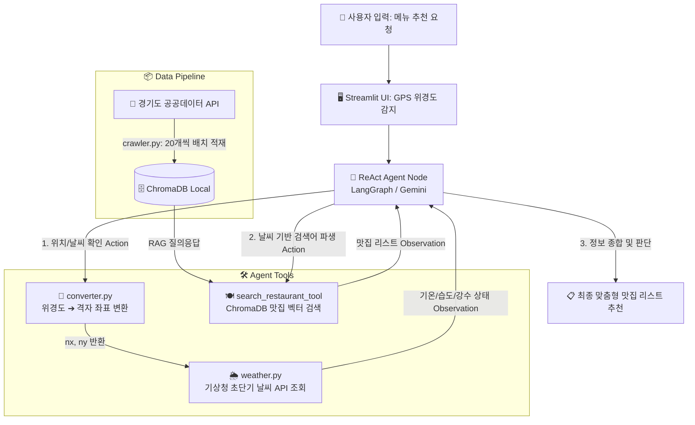

# 🍽️ Context-Aware Food Planner AI

**"오늘 뭐 먹지?"라는 고민을 끝내줄, 실시간 상황 인지형 맛집 추천 AI 에이전트**

## 📌 프로젝트 소개

매일 반복되는 점심/저녁 메뉴 선택의 고민을 해결하기 위해 개발한 **ReAct 기반 실시간 상황 인지형 AI 에이전트**입니다.
단순히 맛집 리스트를 나열하는 챗봇을 넘어, **사용자의 현재 GPS 위치(위경도)와 실시간 기상청 날씨 데이터, 그리고 경기도 공공데이터 기반의 맛집 RAG(검색 증강 생성)**를 유기적으로 결합하여 문맥(Context)에 가장 완벽한 식당을 추천합니다. LangGraph를 이용해 에이전트의 사고 및 행동(ReAct)을 구조화했으며, Docker 기반으로 개발 및 배포의 일관성을 확보했습니다.

---

## 🚀 핵심 기능

* **📍 실시간 위경도 ➔ 기상청 격자 좌표 변환:** 스마트폰/브라우저의 GPS 위경도 좌표를 람베르트 등각 투영법 수식(`converter.py`)을 활용해 기상청 API가 요구하는 격자 좌표(nx, ny)로 실시간 변환.
* **🌦️ 실시간 날씨 기반 문맥 추론:** 기상청 초단기예보/실황 API와 연동하여 현재 기온, 습도, 강수 상태(비/눈 등)를 파악하고, 날씨와 사용자 기분에 어울리는 음식 카테고리를 스스로 판단(예: 비 오는 18도 날씨 ➔ 따끈한 국물 요리).
* **📚 경기도 공공데이터 RAG 구축:** 경기도 맛집 공공데이터 API(`crawler.py`)를 자동 크롤링하고, LLM이 이해하기 쉬운 자연어 문장형으로 전처리하여 로컬 ChromaDB에 적재.
* **🧠 ReAct 에이전트 워크플로우:** LangGraph의 `create_react_agent`를 활용하여 [질문 분석 ➔ 위치/날씨 도구 호출 ➔ 맞춤 검색어 파생 ➔ RAG 검색 ➔ 최종 추천]으로 이어지는 자율적인 지능형 워크플로우 구현.
* **🐳 환경 독립적 컨테이너 배포:** Docker 및 Docker Compose 기반 컨테이너화를 통해 복잡한 의존성 충돌을 원천 차단하고 즉시 실행 가능한 환경 제공.

---

## 🛠 기술 스택

| 구분 | 기술명 |
| --- | --- |
| **LLM** | Google Gemini 1.5 Flash / Gemini 3.1 Flash-Lite |
| **Framework** | LangChain, LangGraph |
| **Vector DB** | ChromaDB (Local Storage) |
| **Data / API** | 기상청 공공데이터 API (API HUB), 경기도 맛집 공공데이터 API |
| **UI** | Streamlit |
| **DevOps** | Docker, Docker Compose |

---

## 🏗 시스템 아키텍처



---

## 📂 프로젝트 구조

```text
.
├── src/
│   ├── agents/
│   │   └── graph.py          # LangGraph ReAct 에이전트 정의 및 시스템 프롬프트 설정
│   ├── db/
│   │   └── loader.py         # ChromaDB 로컬 벡터 데이터베이스 초기화 및 설정
│   ├── tools/
│   │   ├── weather.py        # 기상청 날씨 조회 Tool (핵심 로직과 @tool 분리 설계)
│   │   └── restaurant.py     # 맛집 RAG 검색 Tool
│   ├── utils/
│   │   └── converter.py      # 위경도(Lat/Lon) ➔ 기상청 격자(nx, ny) 변환 모듈
│   ├── crawler.py            # 경기도 공공데이터 API 크롤링 및 벡터 DB 배치 적재 스크립트
│   └── main.py               # Streamlit UI 및 애플리케이션 진입점
├── data/                     # 원본 맛집 데이터 및 로컬 DB 저장소
├── docker-compose.yml        # 컨테이너 오케스트레이션 및 환경변수(API Key) 관리
├── Dockerfile                # 컨테이너 이미지 빌드 설정
└── requirements.txt          # 파이썬 의존성 패키지 목록

```

---
