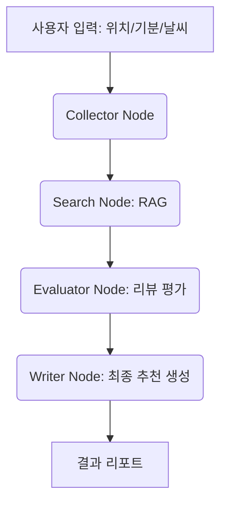

# 🍽️ Context-Aware Food Planner AI

**"오늘 뭐 먹지?"라는 고민을 끝내줄, 상황 인지형 맛집 추천 에이전트**

## 📌 프로젝트 소개

매일 반복되는 점심/저녁 메뉴 선택의 고민을 해결하기 위해 개발한 **상황 인지형 AI 에이전트**입니다.
단순히 맛집을 나열하는 챗봇이 아니라, **사용자의 현재 위치, 날씨, 기분** 등을 종합적으로 고려하여 개인에게 최적화된 식당을 추천합니다. LangGraph를 통해 에이전트의 사고 과정을 구조화하고, 로컬 RAG 환경을 구축하여 비용 효율적인 시스템을 구현했습니다.

## 🚀 핵심 기능

* **상황 기반 추천 (Context-Aware):** 날씨 API와 사용자 입력을 결합하여 기분과 상황에 맞는 메뉴 추천.
* **로컬 RAG 검색:** 외부 API 비용 없이 로컬 벡터 DB(ChromaDB)를 활용한 빠르고 효율적인 맛집 데이터 검색.
* **상태 기반 추론 (Agentic Workflow):** LangGraph를 활용하여 [상황 파악 → 검색 → 평가 → 추천] 단계로 이어지는 지능형 워크플로우 구현.
* **환경 독립적 배포:** Docker 기반 컨테이너화를 통해 어디서든 즉시 실행 가능한 환경 제공.

## 🛠 기술 스택

| 구분 | 기술명 |
| --- | --- |
| **LLM** | Google Gemini 1.5 Flash |
| **Framework** | LangChain, LangGraph |
| **Vector DB** | ChromaDB (Local Storage) |
| **UI** | Streamlit |
| **DevOps** | Docker |

## 🏗 시스템 아키텍처



## 📂 프로젝트 구조

```text
.
├── src/
│   ├── agents/         # LangGraph 노드 및 워크플로우 정의
│   ├── db/             # ChromaDB 로컬 데이터 저장소
│   ├── tools/          # 날씨/위치 API 연동 툴
│   └── app.py          # Streamlit UI
├── data/               # 맛집 데이터(JSON/CSV)
├── Dockerfile          # 컨테이너 설정
└── requirements.txt

```

## 💡 주요 기술적 고민 및 해결

* **비용 최적화:** 매번 외부 API를 호출하는 대신, 특정 지역의 데이터를 로컬 ChromaDB에 캐싱하여 API 호출 횟수를 90% 이상 절감함.
* **에이전트 제어:** LangGraph의 `State`를 활용하여 에이전트가 추천 근거를 스스로 평가하고, 기준 미달 시 재검색하도록 설계함.
* **배포 유연성:** Dockerfile을 작성하여 의존성 충돌 문제를 해결하고, 배포 속도를 향상함.